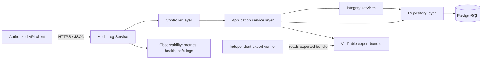
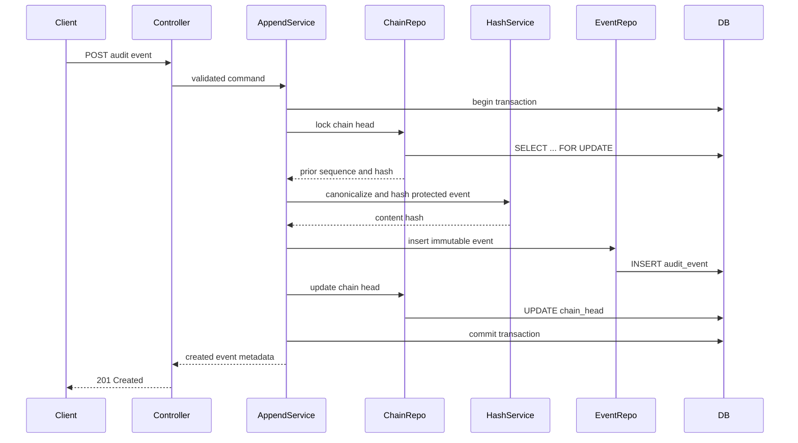
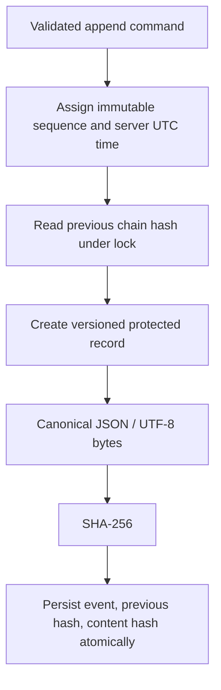
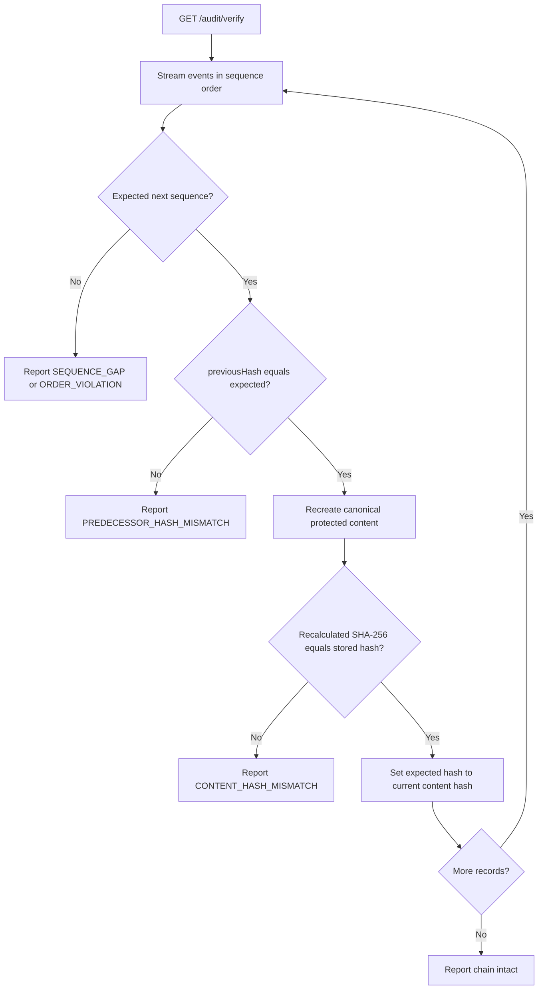

# Architecture Design - Tamper-Evident Audit Log Service

## 1. Design objective

This architecture implements the assignment's core requirement: accept audit events, keep them append-only, query them efficiently, and detect modification of historical records. It is deliberately designed as a modular monolith first: one independently deployable service with a relational database. That keeps the integrity model and transaction boundary simple enough to validate end-to-end, while preserving clean seams for Scenario B extensions and the Scenario C reporting capability.

The proposed implementation target is Java 21, Spring Boot 3, PostgreSQL, Flyway, and JSON over HTTPS. These are technology choices, not assignment requirements; the required behaviour remains independent of the framework.

## 2. High-level architecture



The API service owns all writes to audit-event tables. Application-level immutability is supplemented by database permissions: the runtime identity receives insert/select privileges only for the immutable event table. A separate, tightly controlled migration/administration identity is used for schema changes. This does not make tampering impossible for a privileged database owner; the hash chain makes unauthorised or accidental history changes evident during verification.

## 3. Component responsibilities and rationale

| Component | Responsibilities | Why it exists |
| --- | --- | --- |
| API controller | Map HTTP requests to use cases, validate transport-level input, return documented status/error responses, and never expose event update/delete routes. | Keeps HTTP concerns separate from business and integrity rules. |
| Application services | Orchestrate append, query, verify, retention, redaction, and export use cases; define transaction boundaries and authorization decisions. | Ensures each use case has one clear owner and preserves invariants across components. |
| Domain model | Represents immutable audit events, query criteria, verification results, and domain violations. | Makes core rules testable without HTTP or database dependencies. |
| Canonicalization service | Converts protected event fields into one versioned, deterministic byte representation. | Hashes are only meaningful if equivalent events always produce the same input. |
| Hash-chain service | Computes SHA-256 event hashes, supplies the genesis value, and validates expected predecessor linkage. | Centralizes integrity semantics and prevents different code paths from hashing differently. |
| Repository / persistence adapter | Performs database reads/writes, query filtering, cursor paging, row locking, and streaming verification reads. | Isolates SQL/ORM choices and prevents storage details leaking into domain logic. |
| Database migration module | Creates tables, constraints, indexes, and restricted runtime roles through versioned migrations. | Ensures a reproducible schema and an auditable evolution path. |
| Retention/archive service (Scenario B) | Applies retention policy and creates verifiable archival boundary metadata. | Prevents legitimate retention from looking like untracked record deletion. |
| Redaction service (Scenario B) | Applies authorized payload redaction through a documented commitment-based design and records a redaction action. | Meets privacy needs without silently altering evidence. |
| Export service and verifier | Produces a self-contained bundle and independently validates event content, links, and boundary proofs. | Satisfies the assignment's requirement that recipients verify an export without the service. |
| Security configuration | Authentication, authorization, request-size limits, TLS, CORS policy, and protected operations. | Audit APIs should not become a new source of sensitive-data exposure or unauthorized event injection. |
| Observability configuration | Health/readiness, metrics, correlation IDs, and structured logs that exclude raw sensitive payloads. | Supports production operation while respecting payload confidentiality. |

## 4. Layered architecture and package structure

The package structure follows feature ownership inside a layered boundary. Dependency direction is inward: web and persistence adapters depend on the application/domain layers; domain code does not depend on Spring, HTTP, or JPA.

```text
com.example.auditlog
├── AuditLogApplication
├── api
│   ├── controller          # HTTP routes, request/response mapping
│   ├── dto                 # API contracts and validation annotations
│   └── exception           # API error mapping
├── application
│   ├── command             # Append, redact, archive commands
│   ├── query               # Query and verification request objects
│   ├── service             # Use-case orchestration and transactions
│   └── port                # Storage/export/key-management abstractions
├── domain
│   ├── event               # Immutable audit event and value objects
│   ├── integrity           # Hash, chain, canonical-form, violation model
│   ├── retention           # Archive boundary and retention policy model
│   ├── redaction           # Payload commitment and redaction model
│   └── export              # Verifiable bundle model
├── infrastructure
│   ├── persistence          # JPA/JDBC entities, repositories, SQL adapters
│   ├── crypto              # SHA-256 and canonical JSON implementations
│   ├── export              # Bundle serializer and independent verifier adapter
│   └── clock               # UTC clock adapter
├── config                  # Database, security, JSON, metrics configuration
└── support
    ├── validation          # Shared validation helpers
    └── error               # Domain/application exceptions
```

### Layer rules

| Layer | May depend on | Must not depend on |
| --- | --- | --- |
| Controller / API | Application contracts and DTOs | Persistence entities or cryptographic implementation details |
| Application service | Domain and application ports | HTTP classes, ORM entities, controller DTOs |
| Domain | JDK-level abstractions only | Spring, database, JSON library, network code |
| Infrastructure / repository | Application ports and domain | Controller implementation |
| Configuration | Adapter wiring | Business rules |

This separation is useful in the live review: a reviewer can change an API detail, hash implementation, or persistence mechanism without forcing unrelated logic to change.

## 5. Data model and database interaction

### 5.1 Core tables

| Table | Purpose | Key integrity properties |
| --- | --- | --- |
| `audit_event` | Immutable Scenario A event records. | Sequence is unique and increasing; protected fields, content hash, predecessor hash, and hash version are not updated by the runtime role. |
| `chain_head` | Single-row coordination state for the global chain. | Stores the most recent sequence/hash and is locked during append to serialize chain links. |
| `chain_checkpoint` | Optional signed/external anchor of a chain prefix. | Supports stronger tamper evidence and can accelerate validation at scale. |
| `archive_manifest` | Scenario B record of an authorized archival boundary/range. | Links retained and archived chain sections without pretending deletion is harmless. |
| `redaction_record` | Scenario B immutable proof of authorized redaction. | Identifies the event/path, policy/authority, time, and replacement commitment. |

The minimum `audit_event` record contains a generated sequence and identifier; event type, actor, resource type/ID; server-recorded timestamp; payload representation/commitment; previous hash; content hash; and hash-scheme version. Query indexes support actor, resource type plus ID, event type, recorded time, and the sequence used for cursor paging.

### 5.2 Append database interaction flow



The event insert and chain-head update are atomic. The row lock intentionally serializes global-chain writes. It is a correctness-first choice for the prototype. If high write throughput becomes a requirement, partitioned chains or a durable sequencing service can be introduced, but both alter verification and export design.

### 5.3 Query database interaction flow

1. The controller validates optional filters, time ranges, requested page size, and opaque cursor shape.
2. The query service converts the cursor to the last-seen immutable sequence and applies authorized filter criteria.
3. The repository performs an indexed, ordered read using `sequence > cursorSequence`, fetches at most `pageSize + 1`, and orders by sequence ascending.
4. The service returns matching events and a next cursor only when another row exists.

No query path writes event data. Returned payload views are filtered by authorization and any redaction policy.

## 6. Hash generation design and flow

### 6.1 Protected content

For hash-scheme version 1, the canonical input will include:

- Chain sequence and immutable event identifier.
- `eventType`, `actorId`, `resourceType`, and `resourceId`.
- Server-recorded UTC timestamp in a fixed ISO-8601 precision.
- The canonical payload representation or a documented payload commitment.
- The predecessor hash.
- The hash-scheme version.

The hash is `SHA-256(canonicalBytes)`, stored as lower-case hexadecimal. The genesis predecessor is a published, non-empty constant such as `AUDIT_LOG_GENESIS_V1`, encoded under the same scheme. The exact canonicalization rules must be frozen with test vectors before implementation: sorted object keys, explicit null handling, UTF-8 encoding, fixed timestamp format, and unambiguous number rules.

### 6.2 Hash generation flow



The hash is calculated before persistence, but against the sequence and predecessor selected in the same transaction. A hash is never recalculated opportunistically during normal reads; verification is the explicit recomputation path.

## 7. Chain verification flow



Verification begins with the documented genesis value and expected first sequence. It returns the first inconsistency in storage order, along with sequence, event identifier where available, violation classification, and no sensitive payload content. Streaming avoids loading the entire log into memory. A protected verification operation should also emit metrics and an audit event about the verification request without recursively including its own result in the chain being evaluated.

## 8. Scenario B extension design

### 8.1 Retention and archival

Physical deletion from the main table would break a simple global chain. The preferred design is an immutable archive manifest: before moving an eligible contiguous range to protected archive storage, create a manifest that records its sequence bounds, hashes, policy identifier, archive location/reference, and boundary hashes. The active-chain verifier treats only a valid manifest as an authorized continuity transition; arbitrary missing rows remain a failure.

Soft deletion is simpler operationally and better for the prototype because the original row and its hashes stay available. It does not satisfy storage minimization by itself. The final choice must depend on the required privacy and retention policy, which the assignment leaves open.

### 8.2 Structured redaction

Directly replacing payload plaintext in the original event would invalidate a hash that protects the original payload. The proposed strategy is to separate an immutable payload commitment from the retrievable payload projection:

1. At append time, compute and protect a commitment to the canonical original payload within the event hash.
2. Store any retrievable sensitive representation separately, encrypted with a per-event or per-field data-encryption key.
3. For authorized redaction, cryptographically erase the applicable key and replace the readable projection with a redaction marker; append an immutable redaction record identifying policy, actor, and affected path.
4. Verification continues to validate the original event commitment and chain linkage. It proves the historical record existed, but cannot reconstruct intentionally destroyed plaintext.

This is a deliberate trade-off: it meets a strong deletion/privacy goal and preserves integrity evidence, but requires key management and does not prove the plaintext after redaction to an offline verifier. The architecture must not claim that the raw original payload remains directly hash-verifiable once it has been destroyed.

### 8.3 Verifiable export

An export contains selected events in sequence order plus the hash scheme, genesis/anchor information, predecessor and content hashes, selection criteria, creation time, and left/right boundary proofs tying the subset to the global chain. A standalone verifier replays the included hashes and validates the boundary relationships. For non-contiguous filtered results, the bundle must include sufficient intervening hash links or a checkpoint proof; otherwise it can only prove each event's local content hash, not inclusion in one continuous global chain.

## 9. Security, reliability, and operational design

- Terminate TLS at the ingress/load balancer and require authenticated, authorized clients. Separate write, query, verify, export, retention, and redaction permissions.
- Enforce input validation, JSON depth/size limits, rate limits, and safe error messages. Never log raw payloads by default.
- Use parameterized queries and least-privilege database roles. Run migrations with a separate credential from the service runtime credential.
- Keep database backups encrypted and test restoring followed by chain verification.
- Expose health/readiness separately from protected audit endpoints. Publish latency, append failure, verification result, database, and queue/lock metrics without confidential identifiers.
- Use an idempotency key for writes if clients may retry after uncertain network failures; document whether duplicate logical events are permitted.
- Add periodic signed checkpoints or an external immutable anchor for stronger protection against a privileged actor rewriting the entire database and recomputing the chain.

## 10. Key design decisions and trade-offs

| Decision | Rationale | Trade-off / limitation |
| --- | --- | --- |
| Modular monolith first | A single transaction boundary makes append ordering and verification easier to reason about and demonstrate. | Independent scaling of write/query/verification requires later extraction. |
| PostgreSQL as system of record | Transactions, locking, durable ordering, JSON support, and local reproducibility suit the prototype. | Database-level privileges are not immutable storage. |
| Global sequence-based chain | Gives an unambiguous append order and simple full-chain verification. | A single chain-head lock constrains write throughput and combines tenants. |
| SHA-256 with versioned canonical input | Widely supported and adequate for tamper detection when inputs are deterministic. | Does not prevent a fully privileged attacker from recomputing the complete chain. |
| Server-recorded UTC time | Provides a consistent, controlled audit timestamp. | It differs from real-world occurrence time, so caller-reported time needs a separate field. |
| Cursor pagination by sequence | Stable under concurrent append and efficient with indexes. | Cursors are less convenient for random page navigation. |
| Streaming verification | Bounds memory use for large logs. | Full verification remains O(n); checkpoints can reduce routine verification cost. |
| Commitment plus cryptographic erasure for redaction | Retains evidence while making sensitive plaintext unrecoverable. | Adds key management complexity and cannot later reveal destroyed data. |
| Archive manifests | Distinguishes policy-approved archival from unexplained missing history. | Requires an archive format, policy controls, and boundary-verification logic. |

## 11. Alignment to assignment deliverables

| Assignment expectation | Architecture response |
| --- | --- |
| Working prototype, API/schema, tests | Clear API/application/domain/persistence boundaries and a migration-backed relational model. |
| Append-only events | No update/delete route; immutable domain model and restricted runtime database role. |
| Query filters and pagination | Indexed repository queries and stable sequence cursors. |
| Tamper-evident hash chain | Versioned canonicalization, SHA-256 content hashes, predecessor linkage, and serialized append transactions. |
| `GET /audit/verify` | Streaming verifier with first-failure classification. |
| Direct datastore-tampering proof | Verification distinguishes hash/content/link/order violations after direct changes. |
| Retention, redaction, export | Archive manifests, payload commitments/key erasure, and standalone verifiable bundles. |
| Ambiguous compliance reporting | Explicit authorization, data-classification, reporting, and policy questions remain documented before implementation. |
| Quality and engineer ownership | Isolated responsibilities, testable domain rules, documented trade-offs, and future quality gates. |

## 12. Architecture decisions to validate before coding

1. Approve the global-chain throughput constraint for the prototype, or choose a partitioning strategy before schema work.
2. Freeze canonical serialization and create cross-platform hash test vectors before any event is written.
3. Decide the minimum authentication/authorization model required for the prototype and make its limitations explicit.
4. Select either soft deletion or archive manifests as the initial retention implementation, based on a documented policy assumption.
5. Confirm whether cryptographic erasure is acceptable for redaction or whether a different legal/privacy interpretation requires a revised design.
6. Define export proof semantics for non-contiguous results before implementing the export endpoint.
