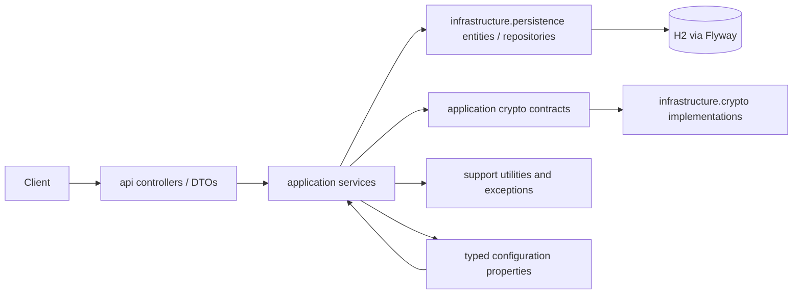

# Architecture - Tamper-Evident Audit Log Service

## 1. Purpose and implemented scope

This repository is a Java 21 / Spring Boot 3.5 modular-monolith prototype of an
append-only audit log. It implements Scenario A (append, query, and full-chain
verification), Scenario B (logical archive manifests, response-projection
redaction, and filtered export), and Scenario C (account-focused compliance
reporting).

The local runtime uses H2 and Flyway. H2 is deliberately a development/demo
database, not a production system of record. Payloads are AES-GCM encrypted;
the audit chain uses SHA-256 over a versioned canonical representation.

## 2. Implemented package structure

```text
com.auditlog
ƒ"oƒ"?ƒ"? api
ƒ",   ƒ"oƒ"?ƒ"? controller       HTTP routes and OpenAPI annotations
ƒ",   ƒ"oƒ"?ƒ"? dto              HTTP request and response contracts
ƒ",   ƒ"oƒ"?ƒ"? exception        Exception-to-HTTP response mapping
ƒ",   ƒ"oƒ"?ƒ"? response         Common API response envelopes
ƒ",   ƒ""ƒ"?ƒ"? validation       Bean Validation helpers
ƒ"oƒ"?ƒ"? application
ƒ",   ƒ"oƒ"?ƒ"? command          Inputs for append operations
ƒ",   ƒ"oƒ"?ƒ"? query            Query criteria, cursors, and sort direction
ƒ",   ƒ"oƒ"?ƒ"? result           Use-case result records
ƒ",   ƒ""ƒ"?ƒ"? service          Transactional append/query/verify/archive/export/report use cases
ƒ"oƒ"?ƒ"? config               Spring configuration and typed configuration properties
ƒ"oƒ"?ƒ"? infrastructure
ƒ",   ƒ""ƒ"?ƒ"? persistence
ƒ",       ƒ"oƒ"?ƒ"? entity       JPA mappings
ƒ",       ƒ""ƒ"?ƒ"? repository   Spring Data JPA repositories
ƒ""ƒ"?ƒ"? support
    ƒ"oƒ"?ƒ"? constant         Shared integrity constants
    ƒ"oƒ"?ƒ"? exception        Application exception and error-code model
    ƒ"oƒ"?ƒ"? utility          Canonical JSON and SHA-256 utilities
    ƒ""ƒ"?ƒ"? web              Correlation-ID request filter
```

The base package is `com.auditlog`. Earlier documents referring to
`com.example.auditlog`, `domain`, or separate export adapters did not describe
this repository and must not be used as an implementation claim. The limited
`application.port` package contains the payload-protection and hash-generation
contracts; their local AES-GCM and SHA-256 implementations live in
`infrastructure.crypto`.

## 3. Actual dependency model



This is a pragmatic Spring layered architecture, **not** ports-and-adapters.
Application services currently depend directly on JPA entities/repositories.
Some application query services also construct `api.dto` response types. This
keeps the prototype small, but couples use cases to the HTTP and persistence
representations. The package layout does not claim a framework-free domain
layer.

## 4. Enforced layer rules

ArchUnit tests in `src/test/java/com/auditlog/ArchitectureRulesTest.java`
enforce boundaries that the current code actually satisfies:

| Rule | Reason |
| --- | --- |
| API controllers must not depend directly on persistence entities or repositories. | HTTP adapters delegate to application services rather than issuing database operations. |
| Persistence classes must not depend on API classes. | JPA mappings and repositories remain reusable without web concerns. |
| Support classes must not depend on API, application, persistence, or configuration packages. | Common utilities and error types remain low-level dependencies. |
| Configuration must not depend on API controllers. | Spring wiring does not take ownership of HTTP endpoint behaviour. |
| Application services must not depend on infrastructure crypto implementations. | Encryption and hashing providers can change without changing the use cases. |

The rules intentionally do **not** prohibit application-to-persistence or
application-to-DTO dependencies because those dependencies exist today. Making
such a rule pass would require a separate ports-and-adapters refactor; it is not
being implied by this architecture document. Crypto is the deliberate exception:
application services depend on the small `HashGenerator` and `PayloadProtector`
contracts, while Spring injects the local implementations. A KMS-backed provider
can replace the payload protector without changing append, query, or verification
use cases.

## 5. Core write and integrity flow

1. `AuditEventController` validates an append request and maps it to
   `AppendAuditEventCommand`.
2. `AuditEventAppendService` starts a transaction and locks the single
   `chain_head` row.
3. It reserves the next sequence, normalizes the server UTC timestamp to
   microseconds, encrypts the payload with AES-GCM, and creates plaintext and
   ciphertext commitments.
4. `AuditEventHashInputFactory` creates a canonical, versioned hash input.
   `Sha256HashGenerator` hashes it with SHA-256 using the current head hash as
   the predecessor.
5. The service persists the immutable event and encrypted payload, then
   advances `chain_head` in the same transaction.

The single row lock is correctness-first: concurrent appends serialize so two
events cannot use the same predecessor hash. It limits write throughput and is
not a partitioned or multi-tenant chain design.

## 6. Query and verification flow

`AuditEventQueryService` accepts exact actor/resource/event filters, inclusive
UTC time bounds, and an opaque cursor backed by immutable chain sequence. It
uses keyset pagination and decrypts only the requested page's payloads. Stored
redaction records are applied when forming the response projection.

`AuditChainVerificationService` streams events in ascending sequence in a
read-only transaction. For every record it checks ordering, predecessor linkage,
payload presence, ciphertext hash, AES-GCM authenticity/plaintext commitment,
recomputed content hash, and the final `chain_head`. It returns the first
observed violation without returning decrypted payload content.

Without parameters, verification streams the complete chain and validates the
final `chain_head`. It accepts optional inclusive `fromSequence` and
`toSequence` bounds for a targeted verification. A bounded request starts with
the nearest preceding stored event hash (or genesis at sequence 1), so the first
selected event's predecessor link is still checked. Bounded verification does
not validate the final chain head and its response explicitly sets
`completeChainVerification=false`; it is therefore not evidence that the
unselected remainder of the chain is intact.

Streaming queries use a JDBC fetch-size hint and the service clears the JPA
persistence context every 100 verified events to bound managed-entity growth.
`chain_checkpoint` remains schema-reserved and unused: the application does not
create or verify signatures, so it must not treat database checkpoint rows as a
trusted basis for skipping historical verification. Full-chain work is still
linear in the number of events; signed externally anchored checkpoints remain a
future scalability and stronger-tamper-evidence control.

## 7. Scenario B behaviour

- **Retention:** `RetentionArchiveService` creates an `archive_manifest` for
  the next eligible contiguous sequence range. This is logical archival only:
  source events remain in H2, and no external archive bundle is written.
- **Redaction:** a redaction request appends a `PAYLOAD_REDACTED` audit event
  and records a JSON Pointer. Queries replace that selected path with
  `[REDACTED]`; ciphertext and original hashes remain stored. It is projection
  redaction, not cryptographic erasure.
- **Export:** a filtered actor or resource export returns event metadata,
  protected hash inputs, boundary hashes, and a canonical bundle hash. It does
  not provide a complete proof for non-contiguous subsets because intermediate
  global-chain records are not included.

## 8. Scenario C behaviour

The compliance endpoint returns `ACCOUNT` records for a supplied account ID and
optional inclusive time bounds. It excludes decrypted payloads and returns
sequence and hash metadata. The current implementation filters by resource type
and account identifier, not by a dedicated access-event taxonomy; this is a
business-semantics issue to resolve before claiming the report lists only access
events.

## 9. Security and production gaps

The prototype has no authentication or authorization. Swagger UI and the H2
console are enabled in the default configuration. The encryption key is supplied
through configuration rather than a KMS. No database runtime-role permissions,
external immutable archive store, signed checkpoints, Docker packaging, CI,
coverage gate, or static-analysis gate is implemented.

These are intentionally listed as gaps, not as capabilities of the current
service. The tamper-evident hash chain detects changes when verification is run;
it does not prevent a privileged database owner from modifying rows or
recomputing an entire chain.
