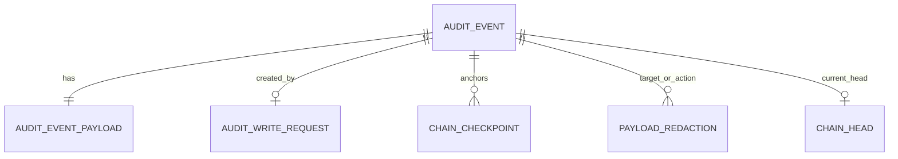

# Database Schema Design - Append-Only Audit Log Service

## 1. Requirements validation

The schema below is aligned with the assignment and the existing requirements analysis:

| Requirement | Schema response |
| --- | --- |
| Write event with type, actor, resource, payload, and timestamp | `audit_event` retains immutable event metadata; `audit_event_payload` retains the encrypted structured payload. |
| Append-only records | No update/delete API will exist; event tables use restrictive foreign keys and the runtime role must receive only `INSERT`/`SELECT`. |
| Hash of content and preceding record | `content_hash`, `previous_hash`, `hash_algorithm`, and `hash_version` are stored with every event. |
| Full-chain verification and first inconsistent record | `chain_sequence` creates one deterministic order; all verification fields are indexed/readable in sequence order. |
| Filter by actor, resource, event type, time | Purpose-specific composite indexes end in `chain_sequence` for cursor paging. |
| Pagination | An immutable, unique `chain_sequence` is the cursor position. |
| Retention and archival | `archive_manifest` represents approved archived ranges and preserves their boundary hashes. |
| Structured redaction | `payload_commitment`, encrypted payload material, and `payload_redaction` preserve evidence while enabling key destruction. |
| Verifiable export | Events, hashes, scheme version, and optional `chain_checkpoint` supply the data needed for an export bundle and boundary proof. |

The SQL is available at [001_initial_audit_log_schema.sql](../database/001_initial_audit_log_schema.sql). It targets H2 2.x and is a reference migration, not an application implementation. The in-memory H2 configuration is for this local prototype; production should use a managed durable database.

## 2. Core integrity model

The service maintains one global chain. Database-assigned `chain_sequence` establishes the only valid event order. An append transaction locks the single `chain_head` row, reads the preceding hash, calculates the new event hash, inserts the event and payload, advances the head, and commits atomically.

For hash version 1, `content_hash` is calculated from a versioned canonical representation of:

- `chain_sequence`, `event_id`, event type, actor, resource type/ID, and `recorded_at`;
- `payload_commitment` - SHA-256 of the canonical plaintext JSON payload;
- `payload_ciphertext_hash` - SHA-256 of the stored encrypted payload bytes;
- `previous_hash`, `hash_algorithm`, and `hash_version`.

This binds both the original plaintext commitment and stored ciphertext to the chain. Before redaction, a verifier can decrypt the payload and confirm that its canonical plaintext hashes to `payload_commitment`; it can always confirm the ciphertext hash. After authorized cryptographic erasure, the plaintext check is intentionally unavailable, but the historical commitment, ciphertext digest, chain link, and redaction evidence remain verifiable.

The fixed genesis hash is SHA-256 of the UTF-8 text `AUDIT_LOG_GENESIS_V1`:

```text
6f631d53cdc1f26efef6d78054e78948c5681f71267c3f9370cf7e5a7a134b39
```

Canonical JSON rules and cross-language test vectors remain a prerequisite before implementing hashing.

## 3. Tables and columns

### 3.1 `audit_event`

The immutable source of truth for Scenario A audit events.

| Column | Type | Purpose and constraint |
| --- | --- | --- |
| `event_id` | UUID | Primary key; server-generated opaque identifier. |
| `chain_sequence` | BIGINT identity | Unique, monotonic event order and pagination cursor. The append transaction reserves the database sequence before hashing, then inserts that reserved value; clients cannot supply it. |
| `event_type` | VARCHAR(100) | Required, non-blank type of action. |
| `actor_id` | VARCHAR(255) | Required, non-blank person/system identity. |
| `resource_type` | VARCHAR(100) | Required, non-blank resource category. |
| `resource_id` | VARCHAR(255) | Required, non-blank resource identifier. |
| `recorded_at` | TIMESTAMP WITH TIME ZONE | Required server-assigned UTC audit time. |
| `payload_commitment` | CHAR(64) | Required lower-case SHA-256 of canonical plaintext JSON payload. It binds the original structured payload without placing plaintext in the event row. |
| `payload_ciphertext_hash` | CHAR(64) | Required SHA-256 of encrypted payload bytes, enabling tamper checks even after the key is destroyed. |
| `previous_hash` | CHAR(64) | Required link to preceding event's content hash; the first event must use the fixed genesis hash. |
| `content_hash` | CHAR(64) | Required SHA-256 of this event's canonical protected representation. |
| `hash_algorithm` | VARCHAR(16) | Explicitly records `SHA-256`, avoiding an implicit cryptographic assumption. |
| `hash_version` | SMALLINT | Positive version number so canonicalization/algorithm changes are controlled and verifiable. |

`chain_sequence` has a uniqueness constraint. Identity sequences may legitimately contain gaps after a rolled-back transaction, so sequence continuity is not an integrity rule. The repository transaction and verification service enforce strict sequence ordering, the genesis link for the first persisted event, and that every later `previous_hash` equals the preceding event's `content_hash`.

### 3.2 `audit_event_payload`

Stores the retrievable payload outside the immutable event metadata so future redaction can remove key access without altering `audit_event`.

| Column | Type | Purpose and constraint |
| --- | --- | --- |
| `event_id` | UUID | Primary key and one-to-one foreign key to `audit_event`; deletion is restricted. |
| `encryption_algorithm` | VARCHAR(64) | Names the authenticated encryption algorithm/version used for the payload. |
| `encryption_key_reference` | VARCHAR(512) | KMS/HSM reference only; never stores a key. |
| `encryption_nonce` | BLOB | Required nonce/IV used for encryption. |
| `ciphertext` | BLOB | Required encrypted canonical JSON payload. |
| `stored_at` | TIMESTAMP WITH TIME ZONE | Time encrypted material was persisted. |

The application verifies `SHA-256(ciphertext)` against `audit_event.payload_ciphertext_hash`. Use authenticated encryption and include metadata needed for decryption as authenticated additional data; exact algorithm/key management remains a security decision before implementation.

### 3.3 `chain_head`

Mutable coordination state for one global chain, not audit history.

| Column | Type | Purpose and constraint |
| --- | --- | --- |
| `chain_id` | SMALLINT | Constant primary key `1`; reserves a future path to partitioned chains. |
| `head_sequence` | BIGINT | Current last sequence; zero only before the first event. |
| `head_hash` | CHAR(64) | Current last event hash or the genesis hash while empty. |
| `head_event_id` | UUID | Current last event; null only when the chain is empty. |
| `updated_at` | TIMESTAMP WITH TIME ZONE | Last successful append coordination update. |

The append service selects this row `FOR UPDATE`. It must confirm that head sequence/hash agree with the event being inserted before committing. This serializes writers, preventing two events from using the same predecessor.

### 3.4 `chain_checkpoint`

An optional, append-only signed anchor for a verified chain prefix. It is not needed for the first Scenario A release, but supports production-scale verification and a stronger threat model.

| Column | Type | Purpose |
| --- | --- | --- |
| `checkpoint_id` | UUID | Checkpoint primary key. |
| `chain_sequence` | BIGINT | Unique referenced event sequence at the checkpoint. |
| `content_hash` | CHAR(64) | Hash expected at that sequence. |
| `signing_key_id` | VARCHAR(255) | Identifies the signing key without storing it. |
| `signature` | BLOB | Signature over the canonical checkpoint record. |
| `anchored_at` | TIMESTAMP WITH TIME ZONE | Creation time. |
| `external_reference` | VARCHAR(1024) | Optional reference to immutable external evidence. |

### 3.5 `audit_write_request`

Supports reliable retries without producing duplicate audit events.

| Column | Type | Purpose |
| --- | --- | --- |
| `idempotency_key` | VARCHAR(128) | Client-provided unique request key. |
| `request_hash` | CHAR(64) | Hash of canonical request input; detects reuse of a key for a different event. |
| `event_id` | UUID | Unique foreign key to the one event created for this request. |
| `accepted_at` | TIMESTAMP WITH TIME ZONE | Request acceptance time. |

This is a production reliability enhancement. If idempotency is deliberately out of scope for the prototype, retain the table design but defer its endpoint contract.

### 3.6 `archive_manifest`

Future Scenario B record for an authorized, contiguous archival range.

| Column | Type | Purpose |
| --- | --- | --- |
| `archive_manifest_id` | UUID | Manifest primary key. |
| `from_sequence`, `to_sequence` | BIGINT | Inclusive contiguous range; `to_sequence` cannot precede `from_sequence`. |
| `predecessor_hash` | CHAR(64) | Hash immediately before the range. |
| `first_content_hash`, `last_content_hash` | CHAR(64) | Boundary hashes of the archived range. |
| `archive_uri` | VARCHAR(2048) | Immutable archive-object location/reference. |
| `archive_bundle_hash` | CHAR(64) | SHA-256 of the exported archive bundle. |
| `retention_policy_version` | VARCHAR(100) | Policy applied to the action. |
| `archived_by`, `archived_at` | VARCHAR / TIMESTAMP WITH TIME ZONE | Accountable actor and time. |

No foreign key is used for the range because records may move out of the primary database after the manifest is written. An archive operation must first verify the exact range, write and independently validate the archive bundle, persist the manifest, and only then remove/move primary storage under an explicit retention policy.

### 3.7 `payload_redaction`

Future Scenario B evidence of an authorized redaction. It does not modify the original event.

| Column | Type | Purpose |
| --- | --- | --- |
| `redaction_id` | UUID | Redaction primary key. |
| `target_event_id` | UUID | Immutable event whose payload path is made inaccessible. |
| `redaction_event_id` | UUID | New audit event that records the redaction action. |
| `json_pointer` | VARCHAR(1024) | Required JSON Pointer path, requiring a `/` prefix. |
| `redaction_reason` | VARCHAR(512) | Required justification. |
| `policy_version` | VARCHAR(100) | Policy under which it was approved. |
| `authorized_by`, `redacted_at` | VARCHAR / TIMESTAMP WITH TIME ZONE | Accountable authorization evidence. |
| `key_destruction_reference` | VARCHAR(512) | KMS/HSM evidence of key revocation/destruction. |

The uniqueness constraint on `(target_event_id, json_pointer)` prevents silently repeating the same path redaction. Field-level cryptographic erasure needs envelope encryption per redaction unit; if the first version encrypts the whole payload with one key, redaction should operate at the whole-payload level until finer-grained keying is implemented.

## 4. Relationships and constraints



- All foreign keys use `ON DELETE RESTRICT`; a normal relational delete cannot silently remove related audit evidence.
- Application runtime database privileges must not include `UPDATE` or `DELETE` on `audit_event`, `audit_event_payload`, `chain_checkpoint`, `archive_manifest`, or `payload_redaction`.
- `chain_head` is the only mutable operational table. Its update is constrained to the append transaction and protected by a row lock.
- Schema migrations use a distinct credential. A privileged database administrator can still tamper with data, disable constraints, or rewrite a full chain; periodic signed/external checkpoints are the proposed mitigation, not a solved property of the SQL schema alone.

## 5. Index strategy

| Index | Query it supports | Design reason |
| --- | --- | --- |
| `idx_audit_event_actor_sequence` | `actorId` + cursor | Locates one actor's events in stable sequence order. |
| `idx_audit_event_resource_sequence` | `resourceType` + `resourceId` + cursor | Covers the required resource filter pair. |
| `idx_audit_event_type_sequence` | `eventType` + cursor | Covers event-type filtering. |
| `idx_audit_event_recorded_at_sequence` | Time range + cursor | Supports range scan followed by stable order. |
| `idx_audit_event_sequence_hash` | Full verification scan/checkpoints | Makes sequence/hash access efficient and supports verification diagnostics. |
| `idx_payload_redaction_target` | Payload-view/redaction lookup | Detects whether an event/path has a redaction record. |
| `idx_archive_manifest_range` | Archive-boundary verification | Finds the manifest covering a missing/archived sequence range. |

The assignment permits filters in any combination. A separate compound index for every possible combination would be wasteful. H2 can use the targeted indexes for the local prototype; a production database should be re-profiled against realistic data before adding workload-specific indexes. Every primary query index ends in `chain_sequence`, enabling keyset pagination without offset-scan degradation.

## 6. Trade-offs and implementation notes

- **Global chain:** simplest verification and a clean direct-tampering demonstration, but the single head lock limits write concurrency. Partitioning later requires chain namespace in every key and export proof.
- **Encrypted payload plus commitment:** supports future privacy/redaction while ensuring a plaintext change is detectable before redaction. It adds KMS and encryption operational complexity compared with plain JSONB storage.
- **Archive manifests:** protect continuity across legitimate deletion/movement, but require a verifier that understands archive bundles and their boundaries.
- **No database trigger for immutability in this migration:** least-privilege runtime roles are clearer and permit the assignment's direct-datastore tampering demonstration. A production deployment may add privileged-role-aware immutable-table triggers after operational workflows are defined.
- **No generic JSONB index:** the assignment does not query by payload fields. Avoiding it limits index bloat and encourages explicit, reviewed query requirements.
## 7. Preconditions before applying the migration

1. Freeze the canonical serialization specification and create hash test vectors.
2. Confirm database role names and grant the runtime account only the least privileges described above.
3. Choose authenticated encryption and KMS/HSM integration; do not generate or store encryption keys in this schema.
4. Define the retention policy and external archive guarantees before enabling physical archival.
5. Define the authorization and approval workflow before enabling redaction or export.
